<p align="center">
  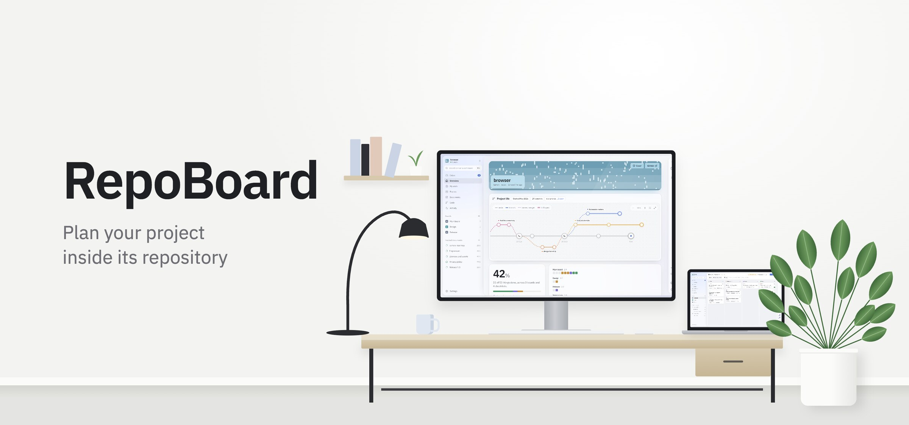
</p>

<h1 align="center">
  <br>
  RepoBoard
</h1>

<p align="center">
  <b>Plan your project inside its repository.</b><br>
  Boards, checklists and a project memory that live next to your code,<br>
  shared with every person and every AI agent who works on it.
</p>

<p align="center">
  <a href="https://github.com/NekoFF/repoboard/releases/latest"></a>
  
  
  <a href="LICENSE"></a>
</p>

<p align="center">
  <a href="https://github.com/NekoFF/repoboard/releases/latest"><b>Download for macOS</b></a>
  &nbsp;·&nbsp;
  <a href="https://github.com/NekoFF/repoboard/releases/latest"><b>Download for Windows</b></a>
  &nbsp;·&nbsp;
  <a href="#try-it-in-one-minute">Try the demo</a>
</p>

<br>

RepoBoard keeps a project's plan where its code already is: as plain files in
`.repoboard/` in your GitHub repository. The app runs on your own computer and
talks only to GitHub — no account, no server of ours, nothing to host. Open it
on a second computer, or give a teammate access to the repository, and the
same boards are there.

It was made for working with AI agents. Claude, Codex or any other MCP client
reads the same boards you do, takes cards, and closes them only with proof —
and what is left for you to check waits in one place.

<br>

## Boards for the work

<picture>
  <source media="(prefers-color-scheme: dark)" srcset="docs/screenshots/board-dark.png">
  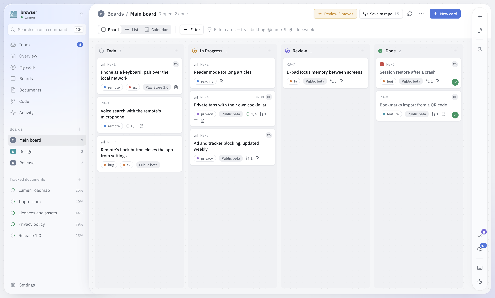
</picture>

One board per person or per area — Design, Release, Core — all in one project.
Each card is a topic with a number (`RB-12`) that is unique across the
project; inside it, numbered items (1, 1.1, 1.2) are the steps, each with
notes, an assignee, a due date and comments. Columns, a list and a calendar,
filters like `label:bug @me !high due:week`, milestones, and a keyboard
shortcut for everything.

| | |
|---|---|
| 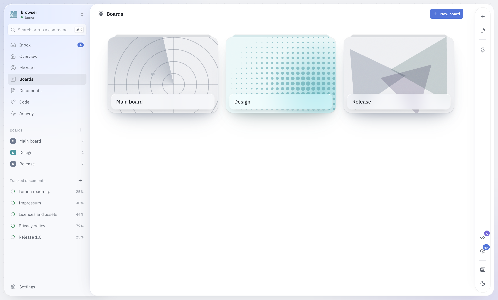 | 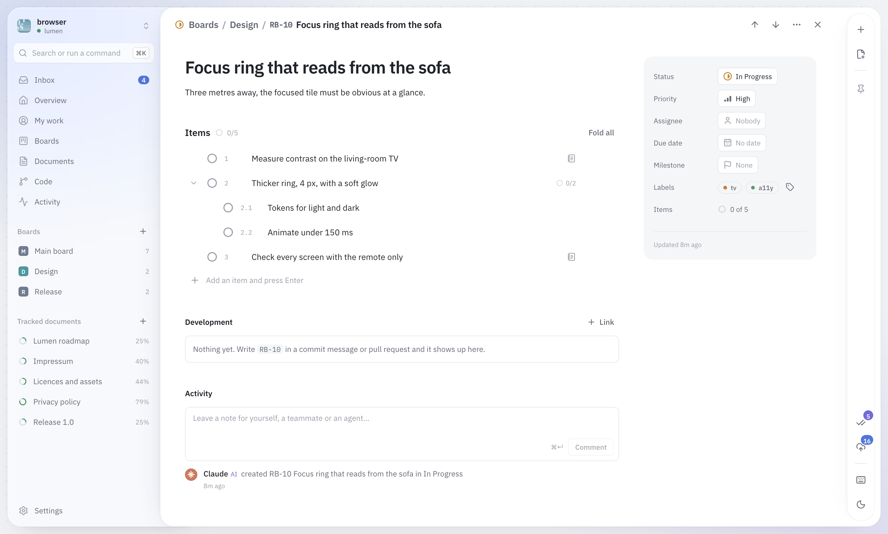 |

## Checklists that must hold

<picture>
  <source media="(prefers-color-scheme: dark)" srcset="docs/screenshots/checklist-dark.png">
  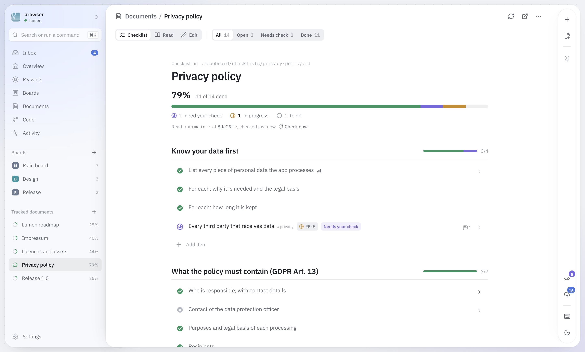
</picture>

Some things are not tasks but statements that have to stay true: the privacy
policy says what the app collects, every font has a licence, the release
build passed. RepoBoard keeps those as checklists — each item can say *why*,
*what to do* and *how to verify* — and the card doing the work is named on the
item. When a card is done, the item asks you to check it.

Tick an item with proof: the file and lines where it is written (kept as a
permalink to that exact version), the words themselves, a screenshot. It goes
under the item with your name and the date.

## Proof, not "done"

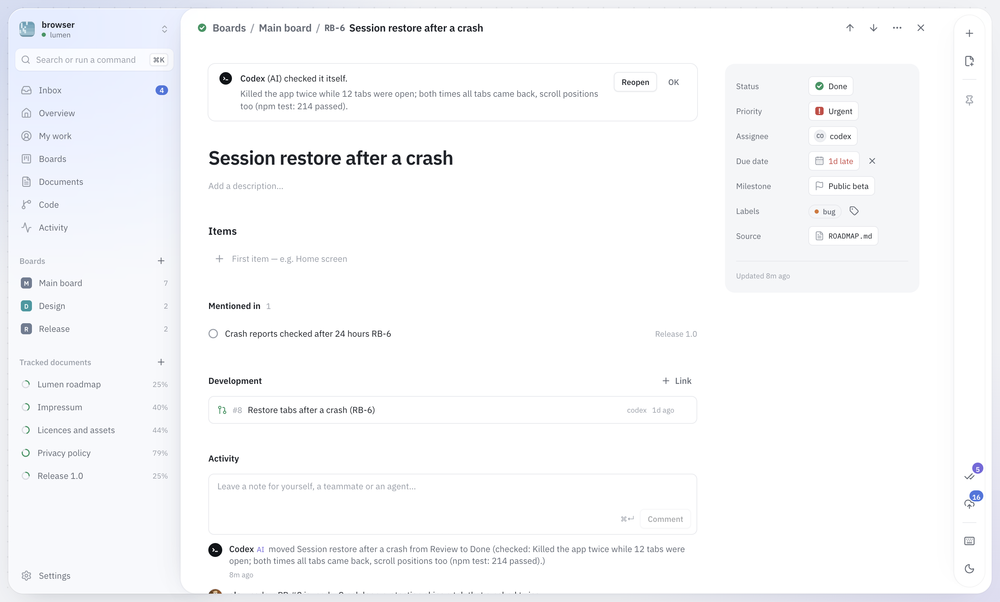

An agent closes a card only when it can say how it knows: it ran it and saw it
work, you told it you checked, or it was done before. That reason stays on the
card for everyone to read. Without proof the card goes to Review and the item
to *needs your check* — one queue for everything waiting for your eyes.
Settings → AI agents can make every close wait for you.

## One project at a glance

<picture>
  <source media="(prefers-color-scheme: dark)" srcset="docs/screenshots/overview-dark.png">
  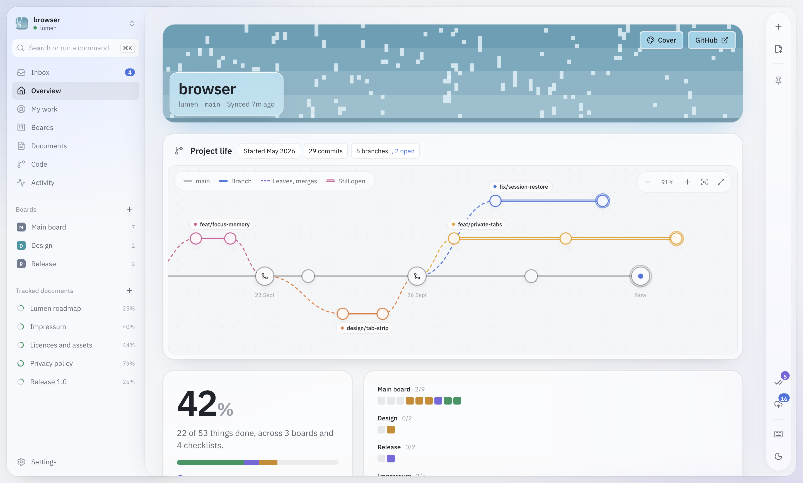
</picture>

The overview opens with the project's life: the main line, branches leaving
and coming back, the ones still open. Under it, one square per item across
every board and checklist, so nothing hides behind a percentage. Commits, pull
requests and issues that mention `RB-12` show up on card 12, and the Inbox
tells you what others — people and agents — did since you last looked.

| | |
|---|---|
| 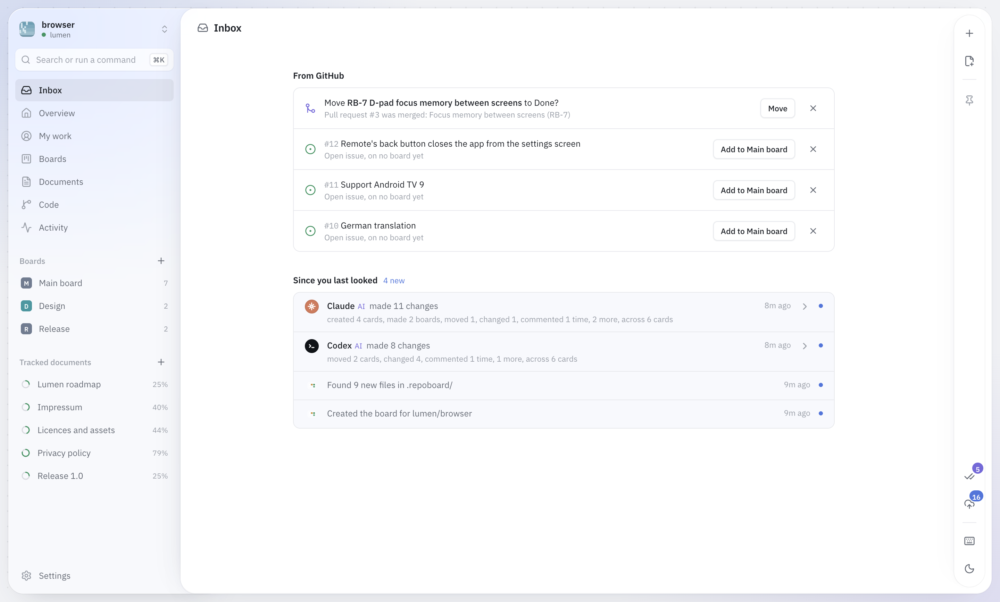 | 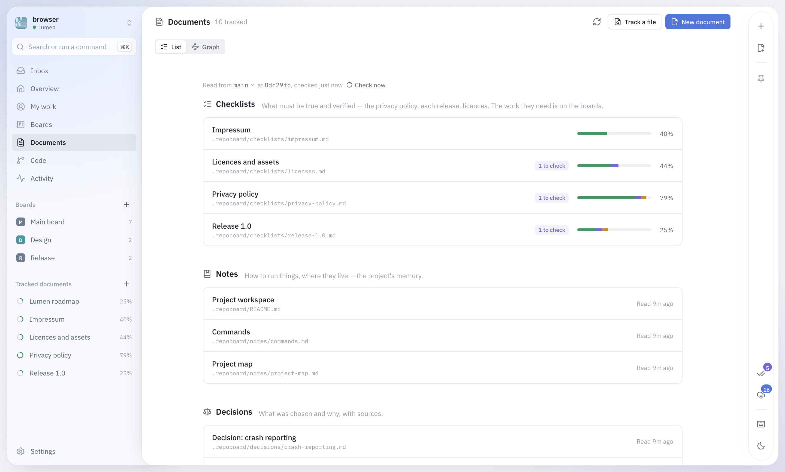 |

<p align="center">
  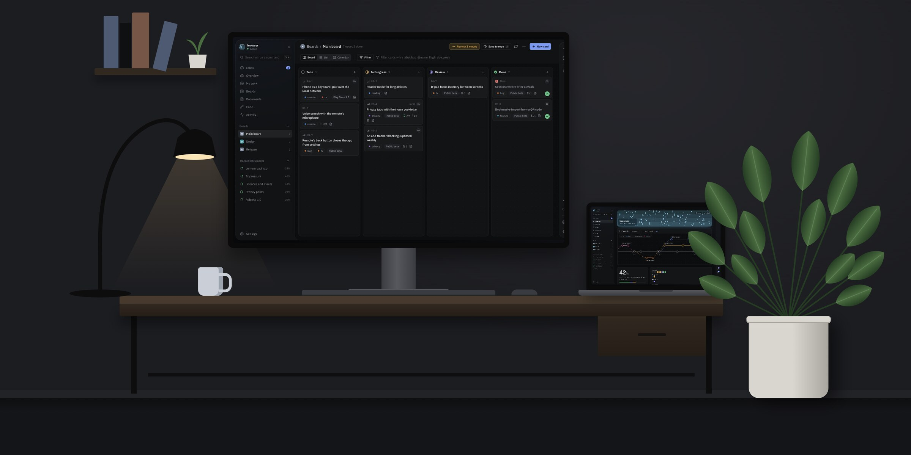
</p>

## Made for AI agents

RepoBoard brings an MCP server. Connect it once and an agent sees the overview,
every board, the documents and the queue of things to check; it creates,
moves and comments on cards on any board, under its own name, marked AI.
Assign it a card and it finds its work with `my_work`.

- **Work on boards, checks in documents.** The server's rules tell agents how
  to organise: steps go in a card's items, a pile of related cards gets its
  own board, a checklist item names the card that does its work.
- **Documents through RepoBoard.** Agents propose new documents, checks and
  ticks; you see each change with its diff and take it or leave it. Or let
  them write directly (Settings → AI agents) — then only files in
  `.repoboard/` are committed, on the documents' branch.
- **Evidence you can open.** With a tick, an agent attaches what shows it
  holds — screenshots, files with lines, links — and you open them from the
  item.
- **Always today's rules.** When RepoBoard updates, connected agents get the
  new tools and rules on their next step, without a restart.

Changes agents make appear on your screen within seconds. Anything that goes
to GitHub — boards, documents, agents' proposals, your own edits — goes with
the one cloud button, each file with its diff, saved together.

<p align="center">
  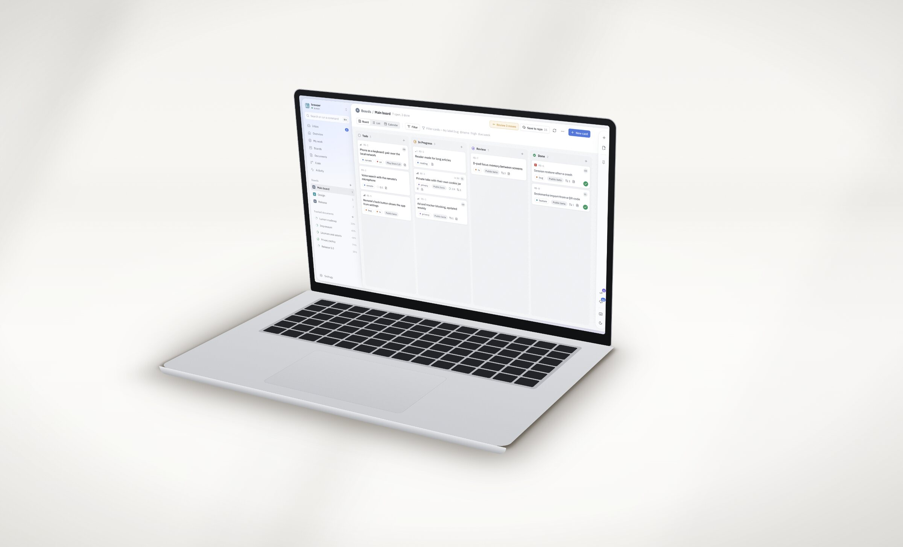
</p>

## The desktop app

Download RepoBoard for **macOS** (Apple silicon or Intel) or **Windows** from
[Releases](https://github.com/NekoFF/repoboard/releases/latest). It is the
whole app in its own window: no Node.js, no terminal. It keeps its data in
`~/.repoboard`, brings its own MCP server for agents (Settings → AI agents
shows the line to paste), and tells you when a new version is out — Settings
→ About also offers a beta channel.

The app is not signed by Apple or Microsoft yet, so the first start asks once:

- **macOS:** open the .dmg and drag RepoBoard to Applications. The first time,
  macOS says it cannot check the developer — open **System Settings → Privacy
  & Security**, scroll down and press **Open Anyway**.
- **Windows:** in the blue window press **More info → Run anyway**.

Then press **Sign in with GitHub**: GitHub shows a short code, you approve
RepoBoard there and pick the repositories it may open. You stay signed in;
RepoBoard renews the sign-in by itself. Repositories where you are only a
collaborator work too. Prefer a key? The connect screen opens GitHub's page
for a fine-grained token with everything filled in. GitLab (gitlab.com or a
company's own server) connects with a personal access token.

<details>
<summary><b>Using a fine-grained token instead of signing in</b></summary>

1. <https://github.com/settings/personal-access-tokens/new>
2. **Resource owner:** you, or the organisation that owns the repository (an
   organisation may have to approve the token first).
3. **Expiration:** as long as you are comfortable with — when it runs out,
   RepoBoard asks for a new one.
4. **Repository access:** *Only select repositories* → the repository.
5. **Permissions** (*+ Add permissions*): Contents *read and write*; Pull
   requests and Issues *read-only*. GitHub adds Metadata by itself.
6. Generate, copy (it starts with `github_pat_`), paste into RepoBoard.

</details>

## Try it in one minute

You need [Node.js](https://nodejs.org) 20 or newer.

```bash
npm install
npm run demo
```

Open <http://localhost:3100>. The demo is a made-up project ("Lumen", a
browser for TVs) served by a small fake GitHub, so no token and no real
repository are involved. `npm run demo -- --reset` starts it over. Every
picture on this page comes from it.

## Gallery

| | |
|---|---|
| 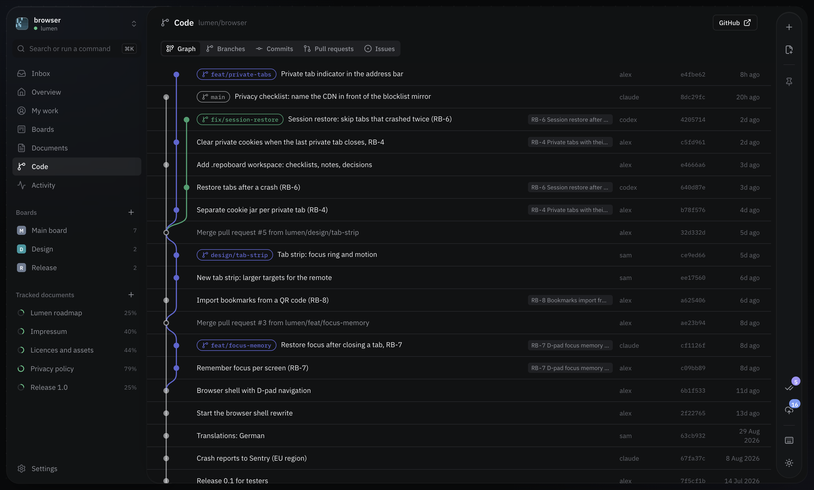 | 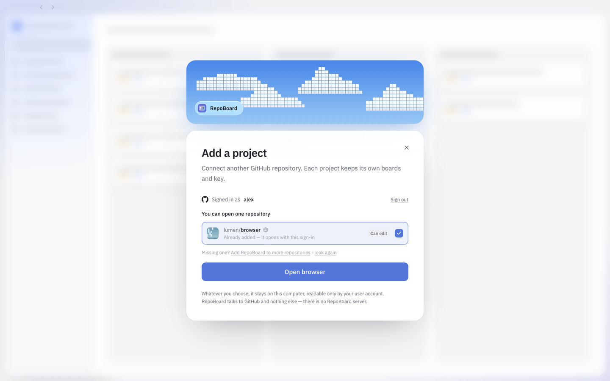 |
| 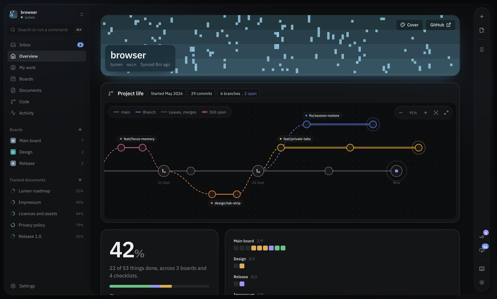 | 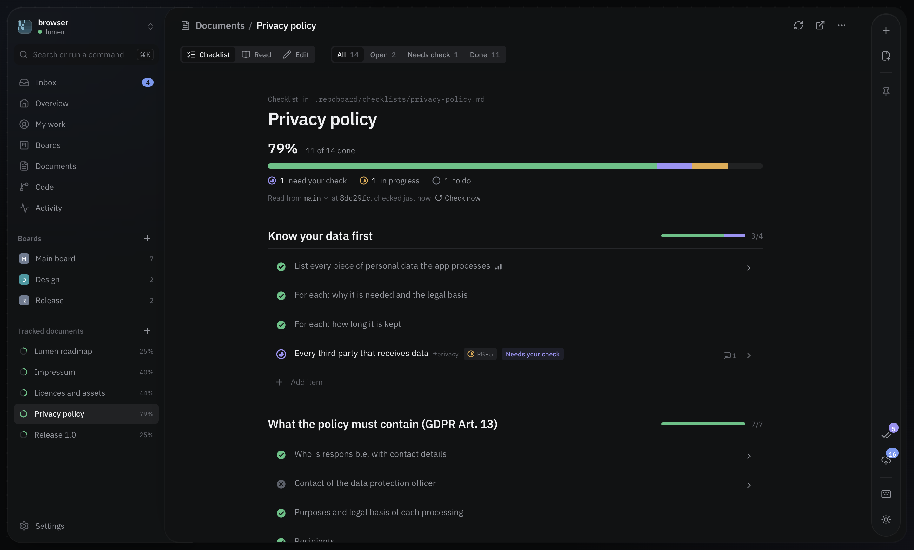 |

---

## The `.repoboard/` folder

```
.repoboard/
  README.md        the rules, for people and agents
  checklists/      what must be true and checked
  notes/           how to run things, where they live
  decisions/       what was decided and why, with sources
  evidence/        screenshots that prove checklist items
  board.json       every board, its cards, order and items (written by RepoBoard)
```

A checklist item looks like this:

```markdown
- [?] Impressum reachable from every screen !high @alex due:2026-10-01 #legal RB-14
  - Why: the provider must be easy to identify.
  - Verify: from a fresh install, reach it in two presses of the remote.
  > codex 2026-09-25: a contact form counts as the second contact channel.
```

`[ ]` to do · `[/]` in progress · `[?]` needs checking · `[x]` done · `[-]` won't do.
The full format is in [docs/FORMAT.md](docs/FORMAT.md). It reads fine on
GitHub and the folder opens as an Obsidian vault.

Boards travel in `.repoboard/board.json`. Press the cloud button to save them
with everything else, or turn on automatic sync: RepoBoard then keeps them on
a `repoboard` branch by itself and never touches your code. A computer that
opens the project for the first time takes the boards from there.

## Connecting an agent

Settings → AI agents shows the exact line for your installation and for each
client. For Claude Code it looks like this:

```bash
claude mcp add repoboard -- node /path/to/repoboard/scripts/mcp-server.mjs
```

The tools are a stable contract: new ones are added, none are renamed or
removed, so an agent set up today keeps working after updates.

## Keyboard

| Keys | Does |
| ---- | ---- |
| `⌘K` / `Ctrl K` | search everything, run any command |
| `G` then `I` `O` `M` `B` `D` `C` `A` | inbox, overview, my work, boards, documents, code, activity |
| `C` | new card |
| `/` | filter the board |
| arrows, `J` `K`, `Enter` | move the selection, open |
| `X`, `1`–`9` | done, send to a column |
| `E`, `⌘Enter` | edit a document, review changes |
| `?` | all shortcuts |

## Where your data is kept

| What | Where |
| ---- | ----- |
| Boards, cards, history | `~/.repoboard/repoboard.db`, and `.repoboard/board.json` in your repository once saved |
| Sign-in and keys | `~/.repoboard/credentials.json` (readable only by you) |
| Checklists, notes, decisions | your repository, `.repoboard/` |

Back up the `~/.repoboard` folder to keep everything local. Updating the app
never touches it.

## Is this safe?

- Tokens stay on your computer and are only ever sent to GitHub (or your
  GitLab). They never reach the browser.
- The app listens on `127.0.0.1` only; other devices on your network cannot
  reach it. Its API answers only its own pages: other websites open in the
  same browser cannot call it, and requests for another host name are refused.
  The desktop app also shares a secret with its own server at every start, so
  other programs on the computer cannot use it.
- Nothing is written to your repository without a diff you approved, and a
  file that changed on GitHub since you opened it is never overwritten. The
  two exceptions are ones you turn on yourself: automatic sync (only
  `board.json`, only on the `repoboard` branch) and agents writing documents
  directly (only `.repoboard/`).
- A program running on your computer as you — an AI agent with a shell, for
  instance — can still read `~/.repoboard`, as it can read any of your files.
  The rules agents follow are enforced in the MCP server, which has no tool
  that writes to GitHub.
- The legal checklists are reminders, not legal advice.

---

<details>
<summary><b>Running it from source, step by step</b> — never used a terminal? About ten minutes.</summary>

<br>

**1. Install Node.js.** Open <https://nodejs.org>, download the **LTS**
version and install it with the default options. On Windows, restart the
computer afterwards. Check it worked: open a terminal and type `node -v` — you
should see `v20` or higher.

**2. Get RepoBoard.** On the repository page click **Code → Download ZIP** and
unpack it somewhere simple (on Windows, e.g. `C:\repoboard` — no spaces or
brackets in the path). Or `git clone https://github.com/NekoFF/repoboard.git`.

**3. Open a terminal in that folder.**
Windows: open the folder in Explorer, click the address bar, type `cmd`, press
Enter (use `cmd`, not PowerShell). macOS: right-click the folder → Services →
New Terminal at Folder. Linux: right-click → Open in Terminal. Type `ls`
(or `dir` on Windows): you should see `package.json`.

**4. Install and start.**
```bash
npm install
npm run dev
```
Leave the window open; closing it stops the app. Open <http://localhost:3000>.
On macOS you can also double-click **`RepoBoard — Start.command`**.

**Stopping and starting again:** `Ctrl+C` stops it; `npm run dev` starts it
again. `npm run stop` stops one that is still running in the background. You
never repeat `npm install` unless you update.

**Updating:** download the new version, replace the app folder (your data is
not in it), then `npm install` and `npm run dev`. Database changes apply
themselves on start.

</details>

<details>
<summary><b>Troubleshooting</b></summary>

<br>

**Run the built-in check first:** `npm run doctor` — it explains problems in
plain words. If it reports the database engine, `npm run fix` usually solves it.

**Windows: `running scripts is disabled on this system`** — you are in
PowerShell. Use `cmd` instead, or run `npm.cmd install` / `npm.cmd run dev`,
or once: `Set-ExecutionPolicy -Scope CurrentUser -ExecutionPolicy RemoteSigned`.

**Windows: `A positional parameter cannot be found`** — the folder path has
spaces or brackets (e.g. `repoboard-main (1)`). Rename the folder, or quote the
path: `cd "C:\Users\you\Downloads\repoboard-main (1)"`.

**`node` or `npm` is not recognised** — Node is not installed, or Windows was
not restarted afterwards.

**`Could not locate the bindings file` / `node-gyp` / `MSBuild` errors** — the
database engine has no ready-made binary for your Node version. Update to the
current RepoBoard, delete `node_modules`, `npm install` again. Still failing:
install the LTS version of Node.

**`EADDRINUSE :::3000`** — RepoBoard is already running somewhere. Close that
window, or use another port: `npm run dev -- -p 3001`.

**"Bad credentials" or "Not Found" when connecting** — the token is wrong,
expired, or was not given access to that repository.

**macOS: "RepoBoard is damaged"** — an old download from before 0.6.5. Get the
current one from Releases.

</details>

<details>
<summary><b>For developers</b></summary>

<br>

```bash
npm run dev          # http://localhost:3000, bound to 127.0.0.1
npm run demo         # against the fake GitHub in scripts/demo-github.mjs
npm test             # unit and integration tests
npx tsc --noEmit     # types
npm run build        # production build (writes to .next-build)
npm run db:generate  # a migration after changing db/schema.ts
npm run mcp          # the MCP server on stdio
```

Next.js 14 (app router) · React 18 · Tailwind with CSS-variable tokens ·
SQLite through Drizzle · Octokit · dnd-kit · Radix primitives · cmdk ·
remark · Electron for the desktop app. See [CLAUDE.md](CLAUDE.md) for the
architecture, the rules the code keeps, and where everything lives.

To build the desktop app yourself: `npm ci`, `cd desktop && npm ci`, then
`node desktop/prepare.mjs` and `npx electron-builder --mac` (or `--win`) in
`desktop/`.

</details>

## Licence

RepoBoard is source-available, not open source: you may read it, run it and
change your own copy for personal use or to try it out. Using it in a
business, offering it as a service, or publishing copies needs written
permission. The full terms are in [LICENSE](LICENSE).
